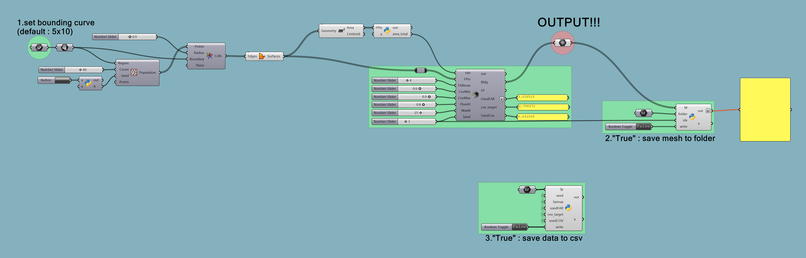

# GH_voronoiMassing

A Grasshopper (`.gh`) definition for generating random Voronoi-based massing geometry.
requires rhino 8 to run python3 component
This repository serves as a geometry preparation stage for the
[CFD_automation](https://github.com/hsiehyuhsiang/CFD_automation) pipeline.

## Overview

This project provides a parametric Grasshopper workflow that generates
Voronoi-based massing configurations for downstream CFD simulations.

All logic is embedded directly within the Grasshopper definition.

## Quick Start

1. Open `voronoi_massing_automation.gh` in Rhino + Grasshopper
2. Set geometry parameters (site boundary, density, random seed, etc.)
3. Run the definition to generate massing geometry
4. Generated STL files are written to the `meshes/` directory of the CFD pipeline

## Notes

- This repository focuses on geometry generation only.
- Simulation and post-processing are handled in the CFD automation repository.
- Generated geometry files are not tracked in this repository.
